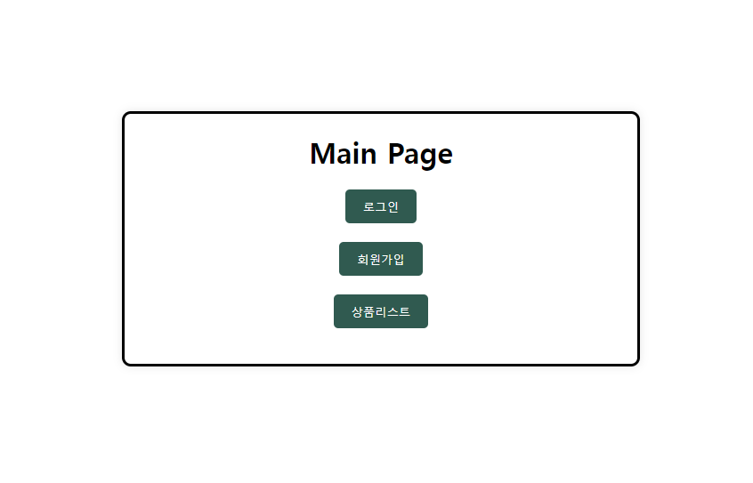
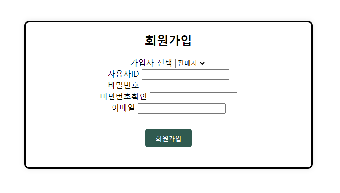
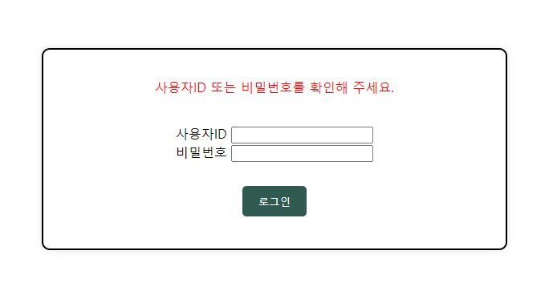
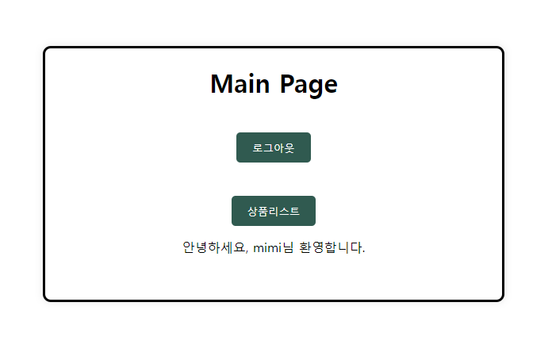
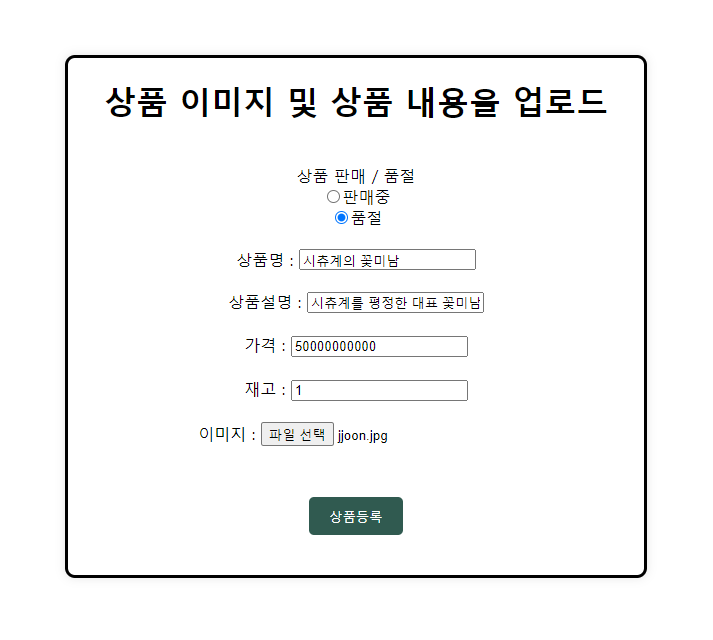

# JPA를 사용한 Shoppingmall

   
  
   

## 프로젝트 소개

JPA를 활용하여 쇼핑몰 가입, 로그인,  사진을 포함한 상품 올리기, 댓글 기능 구현

 

## 기술 스택

### 개발 언어

   
  

 

## 구현 기능

### 회원가입

### 로그인 실패

### 로그인 성공

### 상품 등록

 

## 배운 점 & 아쉬운 점

DB와의 연동으로 값을 집어넣고 빼는 과정이 너무 재미있었다.  조금 더 매끄럽게 CSS를 입히지 못한 것이 아쉽다 ! 

 
